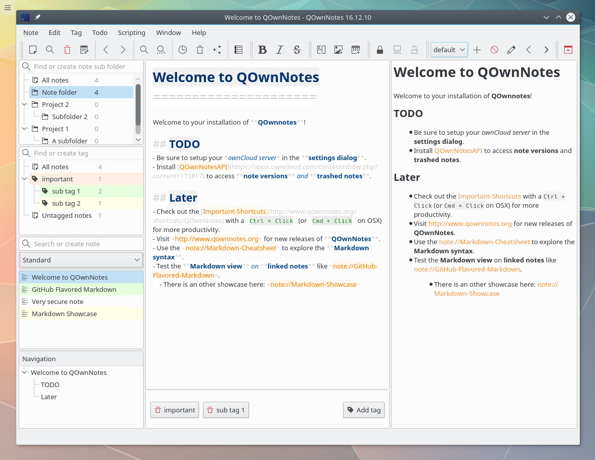

# [QOwnNotes](http://www.qownnotes.org "QOwnNotes Offical Site") 

[Installation](http://www.qownnotes.org/installation) | 
[Changelog](https://github.com/pbek/QOwnNotes/blob/develop/CHANGELOG.md) | 
[Issues](https://github.com/pbek/QOwnNotes/issues) | 
[Releases](https://github.com/pbek/QOwnNotes/releases) |
[Shortcuts](https://github.com/pbek/QOwnNotes/blob/develop/SHORTCUTS.md) |
[Knowledge base](http://www.qownnotes.org/Knowledge-base) |
[Screenshots](http://www.qownnotes.org) |
[ownCloud Apps page](https://apps.owncloud.com/content/show.php?content=168497) |
[IRC Chat](https://kiwiirc.com/client/irc.freenode.net/#qownnotes) |
[Gitter Chat](https://gitter.im/qownnotes/qownnotes)

[](https://travis-ci.org/pbek/QOwnNotes)
[](https://ci.appveyor.com/project/pbek/qownnotes)
[](https://coveralls.io/github/pbek/QOwnNotes?branch=develop)
[](http://isitmaintained.com/project/pbek/QOwnNotes "Percentage of issues still open")
[](https://crowdin.com/project/qownnotes)
[](https://gitter.im/qownnotes/qownnotes)

[QOwnNotes](http://www.qownnotes.org) is the **open source notepad** with **markdown support** and **todo list manager** for **GNU/Linux**, **Mac OS X** and **Windows**, that works together with the default [**notes application**](https://github.com/owncloud/notes) of [**ownCloud**](http://owncloud.org/).

You are able to **write down** your **thoughts** with **QOwnNotes** and **edit or search** for them later from your **mobile device**, like with [CloudNotes](http://peterandlinda.com/cloudnotes/) or the **ownCloud web-service**.

The notes are stored as **plain text files** and are **synced with ownCloud's/Nextcloud's file sync** functionality. Of course other software, like [Dropbox](https://www.dropbox.com) can be used too.

I like the concept of having notes accessible in plain text files, like it is done in the [**ownCloud notes app**](https://github.com/owncloud/notes), to gain a maximum of **freedom**, but I was not able to find a decent desktop note taking tool or a text editor, that handles them well. Out of this need **QOwnNotes** was born.

Visit the project page here: [QOwnNotes project page](http://www.qownnotes.org)

To manage your **todo lists** you need [ownCloud tasks](https://apps.owncloud.com/content/show.php/Tasks?content=164356) or [Tasks++](https://apps.owncloud.com/content/show.php/Tasks+Plus?content=170561) as backend, with which you also can manage your todo lists in the **web** and on your mobile devices.

To get more features for your notes with ownCloud, like **versioning** and **trash** access, you might also want to install [QOwnNotesAPI](https://github.com/pbek/qownnotesapi) on your ownCloud server.

To access your ownCloud notes from your **mobile device** you may want to get these:
- [MyOwnNotes for Android](https://f-droid.org/app/org.aykit.MyOwnNotes)
- [CloudNotes for iOS](https://itunes.apple.com/de/app/cloudnotes-owncloud-notes/id813973264?mt=8)

## Screenshot


You can visit the [QOwnNotes project page](http://www.qownnotes.org) for more **screenshots**.

## Features
- multiple note folders can be used
- older versions of your notes can be restored from your ownCloud server (install [QOwnNotesAPI](https://github.com/pbek/qownnotesapi) on your server)
- trashed notes can be restored from your ownCloud server (install [QOwnNotesAPI](https://github.com/pbek/qownnotesapi) on your server)
- sub-string searching of notes is possible and search results are highlighted in the notes
- application can be operated with customizable keyboard shortcuts
- external changes of note files are watched (notes or note list are reloaded)
- differences between current note and externally changed note are showed in a dialog
- markdown highlighting of notes and a markdown preview mode
- notes are getting their name from the first line of the note text (just like in the ownCloud notes web-application) and the note text files are automatically renamed, if the the first line changes
    - this feature can also be turned off and you can use any filename you like
- manage your ownCloud todo lists (ownCloud tasks or Tasks Plus / Calendar Plus)
- encryption of notes (AES-256 is built in or you can use custom encryption methods like
  **[Keybase.io](https://keybase.io)** ([encryption-keybase.qml](https://github.com/pbek/QOwnNotes/blob/develop/doc/scripting/encryption-keybase.qml)) or
  **PGP** ([encryption-pgp.qml](https://github.com/pbek/QOwnNotes/blob/develop/doc/scripting/encryption-pgp.qml)))
- dark mode theme support
- all panels can be placed wherever you want, they can even float or stack (fully dockable)
- toolbars are fully customizable
- support for freedesktop theme icons, so you can use QOwnNotes with your 
  native desktop icons and with your favorite dark desktop theme
  QOwnNotes supports Freedesktop icon themes
- QOwnNotes is available in many different languages like English, German, 
  French, Polish, Chinese, Russian, Portuguese, Hungarian, Dutch and Spanish
    - [YOUR help](http://www.qownnotes.org/Knowledge-base/How-can-I-help-to-translate-QOwnNotes)
      is needed to maintain these translations or to translate QOwnNotes 
      in more languages
- support for hierarchical note tagging and note subfolders
- support for sharing notes on your ownCloud server
- portable mode for carrying QOwnNotes around on USB sticks
- Evernote import

## Building QOwnNotes
To get the most current features you can build the application from the source code. Download the latest source here: [QOwnNotes Source on GitHub as ZIP](https://github.com/pbek/QOwnNotes/archive/develop.zip)

Alternatively you can also checkout the code directly from the git repository:

```shell
git clone https://github.com/pbek/QOwnNotes.git -b master
cd QOwnNotes
git submodule update --init
```

Then download [Qt Creator](http://www.qt.io/download-open-source), open the project file `src/QOwnNotes.pro` and click on *Build / Build Project QOwnNotes*.

Or you can build it directly in your terminal:

```shell
cd src
qmake
make
```

Please feel free to contribute source code to this project, make suggestions or report troubles on the [QOwnNotes issues page](https://github.com/pbek/QOwnNotes/issues)!

You can also visit [QOwnNotes on GitHub](https://github.com/pbek/QOwnNotes).

## Chat

### IRC

If you are having trouble or would like to help out, join `#qownnotes` on Freenode.

Kiwi IRC (IRC in your web browser): [QOwnNotes IRC](https://kiwiirc.com/client/irc.freenode.net/#qownnotes)

### Join the Gitter channel

[](https://gitter.im/qownnotes/qownnotes)

## Minimum software requirements

- A desktop operating system, that supports [Qt](http://www.qt.io/)
- Qt 5.3+
- gcc 4.8+

## Disclaimer

This SOFTWARE PRODUCT is provided by THE PROVIDER "as is" and "with all faults." THE PROVIDER makes no representations or warranties of any kind concerning the safety, suitability, lack of viruses, inaccuracies, typographical errors, or other harmful components of this SOFTWARE PRODUCT. 

There are inherent dangers in the use of any software, and you are solely responsible for determining whether this SOFTWARE PRODUCT is compatible with your equipment and other software installed on your equipment. You are also solely responsible for the protection of your equipment and backup of your data, and THE PROVIDER will not be liable for any damages you may suffer in connection with using, modifying, or distributing this SOFTWARE PRODUCT.

[](http://www.qownnotes.org)
